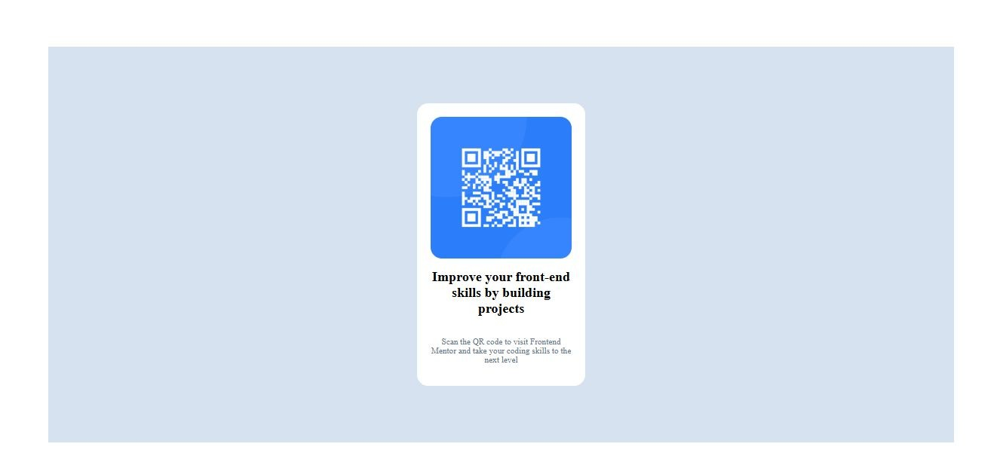

# Frontend Mentor - QR code component solution
This is my solution to the  [QR code component challenge on Frontend Mentor](https://www.frontendmentor.io/challenges/qr-code-component-iux_sIO_H) on Frontend Mentor. This challenge helped me improve my HTML, CSS, and responsive design skills.
## Table of contents

- [Overview](#overview)
  - [Screenshot](#screenshot)
  - [Links](#links)
- [My process](#my-process)
  - [Built with](#built-with)
  - [What I learned](#what-i-learned)
  - [Continued development](#continued-development)
  - [Useful resources](#useful-resources)
  - [AI Collaboration](#ai-collaboration)
- [Author](#author)
- [Acknowledgments](#acknowledgments)

## Overview

### Screenshot

### Links

- Solution URL: https://github.com/LUALABA22/QR-Code.git
- Live Site URL: 
## My process

### Built with

- Semantic HTML5 markup
- CSS custom properties
- Flexbox
- Mobile-first workflow

### What I learned

This project helped me better understand responsive design and the 'box-shadow' property

### Continued development

I want to continue improving my skills in :
  - CSS Grid
  - CSS animations
  - Creating more complex responsive layouts

### Useful resources

  - Frontend Mentor
  - MDN Web Docs

### AI Collaboration

I used ChatGPT during this project to:
- Understand CSS concept
- Improve the responsiveness of my layout
- Review and optimize my code

## Author

- Frontend Mentor - @LUALABA22
- Github - @LUALABA22

## Acknowledgments

Thanks to Frontend Mentor for providingn high-quality challenges that help developers improve throught practice.
